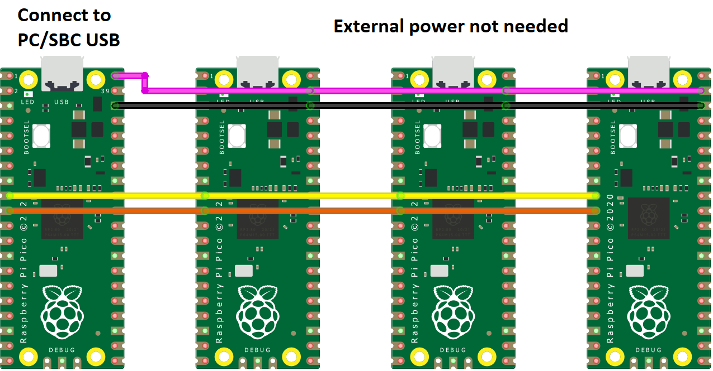

# DuinoCoinUSBI2C_Adaptor
This project is designed to allow computer without I2C interface to mine [Duino-Coin](https://github.com/revoxhere/duino-coin) on I2C miner. The adaptor is suitable for most AVR/ESP with USB-Serial chip onboard.

Using a single USB port to communicate with all the boards and make a scalable I2C mining rig with or without USB hub

This USBI2C Adaptor exists because SBC like Raspberry Pi is either too expensive or there is challenge in supply. Whereas PC/laptop is what most people already have, the adaptor can be used to test the I2C rig or solution to mine Duino-Coin

## Video Tutorial

coming soon

## Python Environment Setup

### Linux

```BASH
sudo apt update
sudo apt install python3 python3-pip git screen -y # Install dependencies
git clone https://github.com/JK-Rolling/DuinoCoinUSBI2C_Adaptor.git # Clone DuinoCoinUSBI2C_Adaptor repository
cd DuinoCoinUSBI2C_Adaptor
python3 -m pip install -r requirements.txt # Install pip dependencies
````

Finally, connect your USBI2C_Adaptor to USB and I2C AVR miner, and launch the software (e.g. `python3 ./AVR_Miner_USBI2C.py`)

### Windows

1. Download and install [Python 3](https://www.python.org/downloads/) (add Python and Pip to Windows PATH)
2. Download [the DuinoCoinUSBI2C_Adaptor](https://github.com/JK-Rolling/DuinoCoinUSBI2C_Adaptor/releases)
3. Extract the zip archive you've downloaded and open the folder in command prompt
4. In command prompt type `py -m pip install -r requirements.txt` to install required pip dependencies

Finally, connect your USBI2C_Adaptor to USB and I2C AVR miner, and launch the software (e.g. `python3 AVR_Miner_USBI2C.py` or `py AVR_Miner_USBI2C.py` in the command prompt)

## Version

DuinoCoin USBI2C Version 2.75

# USBI2C - USB-to-I2C Master

The adaptor can be any board with USB-Serial chip such as CH340, CP201x

Supported board includes ESP8266 (e.g. Nodemcu, Wemos Lolin), ESP32 (not tested), Arduino Nano/UNO

The baudrate affects how fast the Serial port communicates. The stable baudrate is 115200. Other baudrate may or may not work properly

Modify `#define BAUDRATE 115200` to change the baudrate of USBI2C adaptor

# Miner - I2C Slave

The corresponding I2CS worker code can be downloaded from [DuinoCoinI2C_RPI](https://github.com/JK-Rolling/DuinoCoinI2C_RPI)

Supported AVR includes Arduino Nano/UNO, ATtiny85, Pico

## Max Client/Slave

USBI2C adaptor will scan I2CS from address 0x1 to 0x7f

The theoretical number can be up to 126 I2CS slaves per USBI2C adator

With multiple instances of USBI2C adaptor, the average share rate can be improved by dividing workers across them

# Connection Pinouts

Connect the pins of USBI2C and AVR like the table/images below, use a [Logic Level Converter](https://www.sparkfun.com/products/12009) to connect between the ESP and Arduino/ATtiny85. LLC is not needed if Nano/UNO itself is the adaptor

|| ESP8266 | Logic Level Converter | Arduino |
|:-:| :----: | :-----: | :-----: |
||3.3V | <---> | 5V |
||GND | <---> | GND |
|`SDA`| D2 | <---> | A4 |
|`SCL`| D1 | <---> | A5 |

|| ESP8266 | Logic Level Converter | ATtiny85 |
|:-:| :----: | :-----: | :-----: |
||3.3V | <---> | 5V |
||GND | <---> | GND |
|`SDA`| D2 | <---> | PB0 |
|`SCL`| D1 | <---> | PB2 |

|| Nano || Nano |
|:-:| :----: | :-----: | :-----: |
||5V | <---> | 5V |
||GND | <---> | GND |
|`SDA`| A4 | <---> | A4 |
|`SCL`| A5 | <---> | A5 |

|| Pico || Pico |
|:-:| :----: | :-----: | :-----: |
||VBUS | <---> | VSYS |
||GND | <---> | GND |
|`SDA`| GP6 | <---> | GP6 |
|`SCL`| GP7 | <---> | GP7 |

**Nano USBI2C**


**Wemos USBI2C**


**Nodemcu USBI2C**


**Pico USBI2C**


# License and Terms of service

All refers back to original [Duino-Coin licensee and terms of service](https://github.com/revoxhere/duino-coin)
